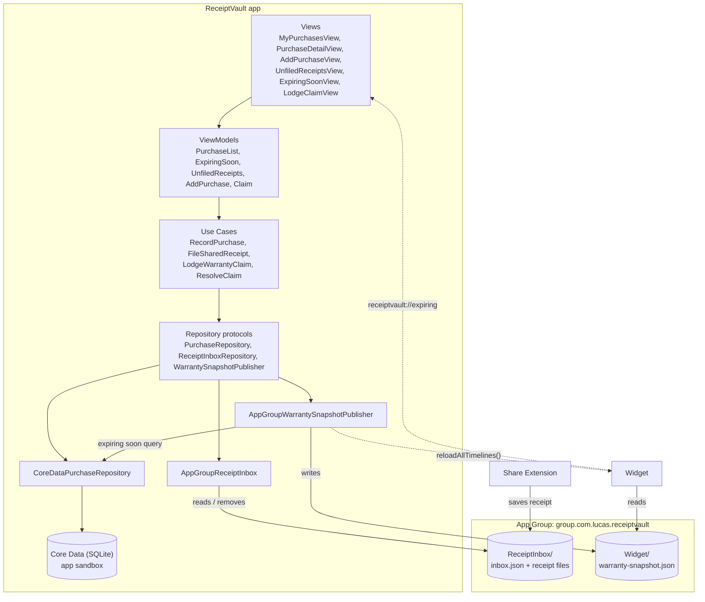

# Receipt Vault

Receipt Vault is an iOS app I built for UTS iOS Development Assessment 3. It keeps your receipts and warranties in one place, tells you when a warranty is about to run out, and lets you log warranty claims. You can share a receipt into the app from Mail, Photos or Files, and there's a widget that shows which warranties end in the next 30 days.

## The problem

People lose receipts and forget when their warranties end. Then when something breaks they either can't prove where and when they bought it, or they've missed the warranty by a few weeks. On top of that, a lot of people get told "you're not covered" once the manufacturer's warranty is over, even though the Australian Consumer Law (ACL) consumer guarantees can still apply.

The person I designed this for is an everyday Australian shopper buying electronics and appliances from places like JB Hi-Fi, Harvey Norman, The Good Guys, Apple and Bunnings.

The ACCC says consumer guarantees apply automatically no matter what warranty you have, they can last longer than the warranty, and a business can ask for proof of purchase like a receipt. CHOICE has reported on people being sold extended warranties that don't add much to their ACL rights, and being told they aren't covered after a warranty ends. *(TODO: add the exact ACCC and CHOICE references from my Required Document.)*

Because of this, the app never says "Not covered". An ended warranty shows as "Manufacturer warranty ended". If you try to lodge a claim on it you get: "This warranty ended on <date>. You may still be covered under the Australian Consumer Law. Contact the retailer directly."

## Architecture

The app is split into layers, and each layer only talks to the one below it through protocols. Views and ViewModels never import CoreData.



Folders inside `ReceiptVault/`:

- `Domain/`: Purchase, Warranty, WarrantyClaim, the enums, warranty status and the expiring soon query
- `UseCases/`: the four use cases, each with its own error enum
- `Repositories/`: the protocols and their Core Data, App Group and in-memory versions
- `Persistence/`: the Core Data model (built in code), managed object classes and PersistenceController
- `ViewModels/`: the ViewModels, plus ShopperAlert for showing errors
- `Views/`: the six screens, the tab view and a few shared components
- `Shared/`: files that also get compiled into the extensions
- `App/`: the app entry point, AppContainer (where everything gets wired up) and sample data for debug builds

The business rules are in the use cases:

- RecordPurchase: the purchase date can't be in the future, the price has to be more than $0, and each warranty has to be 0 to 120 months. It also calculates and stores the warranty expiry date. Nothing else sets that.
- FileSharedReceipt: the receipt has to still be in the inbox, and a purchase can only have one receipt. It uses the same rules as RecordPurchase, saves the purchase, then removes the receipt from the inbox.
- LodgeWarrantyClaim: the warranty can't have ended, and it can't already have an open claim (lodged or in progress).
- ResolveClaim: only an open claim can be marked resolved or rejected.

The current date and calendar are passed into the use cases, so the tests can set "today" to a fixed date. After a successful save, each use case asks the widget to update through the WarrantySnapshotPublisher protocol.

## Extensions

### Share Extension

Scenario: Priya gets a PDF tax invoice from JB Hi-Fi by email. She taps the PDF in Mail, hits Share and picks Receipt Vault. It says "Saved to Receipt Vault. Open the app to file it." and closes. When she opens the app later, it goes straight to Unfiled Receipts with a badge on the tab. She taps the receipt, fills in the item and warranty, and taps File Receipt.

- It only shows up for one image or one PDF.
- It copies the file into `ReceiptInbox/` in the App Group and adds it to `inbox.json`. Writes use NSFileCoordinator and are atomic, so the app and the extension can't overwrite each other.
- It always closes itself: completeRequest after saving, or cancelRequest if you hit Cancel or Close.

### Widget

Scenario: Sam has the medium widget on his home screen and sees "Dishwasher, 9 days left". He taps it, the app opens on Expiring Soon, and he lodges a claim for the leaking door seal before the warranty runs out.

- Small shows the warranty ending soonest with a big day count. Medium shows up to 3. The Lock Screen version shows one line like "Dishwasher · 9 days left".
- It reads `Widget/warranty-snapshot.json` and works out the days left when it draws. The timeline has one entry for now and one for midnight so the count goes down each day.
- If there's no snapshot file it shows "No warranties ending in the next 30 days" instead of crashing.
- Tapping it opens `receiptvault://expiring`, which takes you to the Expiring Soon tab.

## Why Core Data

The data is relational: a purchase has many warranties, and a warranty has many claims. I needed cascade deletes, and I needed a query for "warranties ending in the next 30 days with no open claim". Core Data handles this well:

- The relationships have inverses, and deleting a purchase deletes its warranties and claims too.
- The expiring soon query is an NSPredicate that runs in SQLite:
  `expiryDate >= startOfToday AND expiryDate <= startOfToday + 30 days AND SUBQUERY(claims, $c, $c.status IN {"lodged","inProgress"}).@count == 0`
- Prices are stored as Decimal, so there are no rounding problems with dollars and cents.
- It's built into iOS, works on iOS 17, and doesn't need any packages.

*(TODO: add my comparison with SwiftData and the other options from the Required Document.)*

I built the model in code (`ReceiptVaultModel.swift`) instead of using an .xcdatamodeld file. The database lives in the app's own sandbox, not the App Group. Only the inbox and the widget snapshot are shared, so the extensions never touch the database.

App Group: `group.com.lucas.receiptvault`

## Setup

You need Xcode 26.5 (that's what I built it with). The app targets iOS 17.0 and doesn't use any third-party packages.

1. Open `ReceiptVault.xcodeproj`.
2. Set your signing team on all three targets (ReceiptVault, ReceiptVaultShare and ReceiptVaultWidgetExtension) under Signing & Capabilities. If the bundle IDs are taken, change `lucastohmeh.ReceiptVault` to something else on all three. The extension IDs have to start with the app's ID.
3. Check that App Groups has `group.com.lucas.receiptvault` ticked on all three targets. With a free personal team you might need to use a different group name, in all three targets and in `SharedContainer.appGroupIdentifier`.
4. Pick an iPhone simulator and press ⌘R. The first time a debug build runs, it adds 5 sample purchases and 1 unfiled receipt.
5. Press ⌘U to run the tests.

Testing the share extension:

- From Photos: drag an image onto the simulator so it goes into Photos. Open it, tap Share, then Receipt Vault. Go back to the app and the receipt shows up in Unfiled Receipts.
- From Files: drag a PDF onto the simulator and save it to On My iPhone. In Files, long press it, tap Share, then Receipt Vault.
- To debug it, choose the ReceiptVaultShare scheme, press ⌘R and pick Photos or Files as the app to run.

Adding the widgets:

- Home screen: long press an empty spot, tap Edit, then Add Widget, search "Receipt Vault", pick small or medium and tap Add Widget.
- Lock Screen: long press the Lock Screen, tap Customise, then Lock Screen, tap under the clock and pick Receipt Vault.
- You can test the link without the widget by running `xcrun simctl openurl booted receiptvault://expiring`.

## Tests

There are 72 unit tests in `ReceiptVaultTests`. The use case tests use mock repositories (`MockPurchaseRepository`, `MockReceiptInbox`, `MockWarrantySnapshotPublisher`), so none of them touch Core Data. The two App Group test files use a temporary folder instead of the real App Group.

- RecordPurchaseTests (13): saves with the right expiry date, accepts a purchase dated today, rejects tomorrow, accepts $0.01, rejects $0 and negative prices, accepts 0 and 120 month warranties, rejects 121 and negative months, updates the widget after saving but not when the purchase is rejected, reports a save failure
- FileSharedReceiptTests (11): files a receipt to a new or existing purchase, rejects a receipt that's no longer in the inbox (including filing the same one twice), keeps the receipt file after filing, rejects a purchase that already has a receipt or doesn't exist, applies the purchase rules, keeps the receipt in the inbox when saving fails, handles inbox read and remove failures
- LodgeWarrantyClaimTests (8): lodges on an active warranty, accepts a warranty ending today, allows a new claim after the old ones are closed, rejects an ended warranty with the consumer law message, rejects a second claim while one is lodged or in progress, handles a missing warranty and a save failure
- ResolveClaimTests (6): resolves a lodged claim, rejects an in-progress one, refuses claims that are already resolved or rejected, handles a missing claim and a save failure
- WarrantyRulesTests (6): a warranty ending today is still active, ended yesterday means ended, day counting, which claim statuses count as open, the ended label wording, the expiring soon query
- WarrantyStatusTests (5): Active, Ending in N days, Manufacturer warranty ended (never "not covered"), still active while an extended warranty runs, Ends today
- WarrantySnapshotTests (5): keeps the 5 soonest, counts days on the day it's drawn, drops a warranty the day after it ends, the day labels, the deep link
- AppGroupReceiptInboxTests (5): starts empty, lists newest first and survives a relaunch, filing keeps the file, discarding deletes it, a missing App Group gives an error instead of a crash
- AppGroupWarrantySnapshotPublisherTests (3): at most 5 warranties, soonest first, no open claims; empty when nothing is expiring; skips quietly with no App Group
- ViewModelTests (9): price parsing, rejecting a price that isn't a number, the Save button rule, showing use case errors as alerts, filing a receipt from the form, the consumer law alert, the unfiled badge count and remove, loading expiring warranties
- ShopperErrorMessageTests (1): every error has a message and a suggestion, with no technical jargon

## Git workflow

`main` should always build and pass the tests. I worked on a branch for each part and merged it back into `main` once the tests passed:

`feature/domain-and-use-cases`, `feature/core-data`, `feature/screens`, `feature/share-extension`, `feature/widget`, `docs/readme-and-review`

Commit messages follow Conventional Commits (`feat:`, `fix:`, `test:`, `docs:`, `chore:`), for example:

```
feat: add LodgeWarrantyClaim with ended-warranty consumer law advice
test: cover filing a receipt twice and discarding unfiled receipts
```

## Assessment checklist

| Requirement | Where |
|---|---|
| Persistent database | `Persistence/PersistenceController.swift`, `Persistence/ReceiptVaultModel.swift` |
| 2+ related entities | PurchaseEntity → WarrantyEntity → WarrantyClaimEntity (`ReceiptVaultModel.swift`, `ManagedEntities.swift`) |
| Domain predicate | `CoreDataPurchaseRepository.fetchExpiringWarranties`, `Domain/ExpiringSoon.swift` |
| Repository protocol + mock | `Repositories/PurchaseRepository.swift` and the other protocols, `ReceiptVaultTests/Support/Mock*.swift` |
| 2 extensions working end to end | `ReceiptVaultShare/` → inbox → Unfiled Receipts → FileSharedReceipt; use cases → snapshot publisher → `ReceiptVaultWidget/` → Expiring Soon |
| App Group | the three `.entitlements` files, `Shared/SharedContainer.swift` |
| Widget families and reload | `ReceiptVaultWidget/ReceiptVaultWidget.swift`, `AppGroupWarrantySnapshotPublisher.swift` |
| Share extension always dismisses | `ReceiptVaultShare/ShareViewController.swift` |
| Meaningful names | domain names throughout, tests named after behaviour |
| 3+ use cases with rules and typed errors | `UseCases/` (4 use cases) |
| Helpful errors | every error has `errorDescription` and `recoverySuggestion`, shown by `ShopperAlert` |
| 5+ screens | 6 screens in `Views/` |
| 5+ tests | 72 tests |
| Git | see Git workflow |
| README | this file |

## References

Apple documentation I used:

- Core Data: https://developer.apple.com/documentation/coredata
- Configuring App Groups: https://developer.apple.com/documentation/xcode/configuring-app-groups
- NSFileCoordinator: https://developer.apple.com/documentation/foundation/nsfilecoordinator
- App Extension Programming Guide, Share: https://developer.apple.com/library/archive/documentation/General/Conceptual/ExtensibilityPG/Share.html
- NSItemProvider: https://developer.apple.com/documentation/foundation/nsitemprovider
- Uniform Type Identifiers: https://developer.apple.com/documentation/uniformtypeidentifiers
- WidgetKit: https://developer.apple.com/documentation/widgetkit
- Observation: https://developer.apple.com/documentation/observation
- QuickLook: https://developer.apple.com/documentation/quicklook
- SF Symbols: https://developer.apple.com/sf-symbols/

Consumer law: ACCC guidance on consumer guarantees and warranties, and CHOICE articles on extended warranties. *(TODO: add exact links and access dates.)*

I used Claude Code (Anthropic) as a coding assistant on this project. I gave it the names, rules and architecture from my Required Document and worked through the app in phases. It wrote code, tests and a first draft of this README, and ran the builds and tests. I reviewed and tested each phase, made the design decisions in my Required Document, and changed things that didn't match what I wanted.
